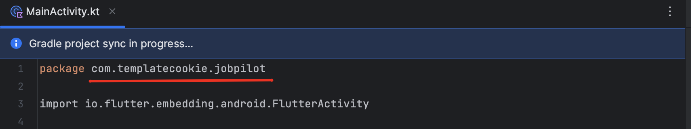

# Change App Name & ID.

>[!NOTE] 
> Please make a copy of the project before following the instructions below. Just incase 
> the commands doesn't work as intended.

## 1. Change App Name (Android)

* Open a file `/android/app/src/main/AndroidManifast.xml` and change the application label.
    ```xml
    <application
    	android:name="io.flutter.app.FlutterApplication"
    	android:label="Replace with your App name"
    	android:icon="@mipmap/ic_launcher"
    	android:usesCleartextTraffic="true"
    >
    ```
## 2. Change App ID (Android)
* Open **`/android/app/build/gradle`** and change the `applicationId` value.
    ```gradle
    defaultConfig {
	applicationId "Replace with your package name"
	minSdkVersion 18
	targetSdkVersion 29
	versionCode flutterVersionCode.toInteger()
	versionName flutterVersionName
	multiDexEnabled true
    }
    ```
* Open **`/android/app/src/main/AndroidManifest.xml`**, **`/android/app/src/profile/AndroidManifest.xml`**, **`/android/app/src/debug/AndroidManifest.xml`** and change the package name.
    ```xml
     <manifest 
        xmlns:android="http://schemas.android.com/apk/res/android"
	    package="Replace with your package name"
    >
    ```
### *Rename Kotlin Folder (Android)

* Open **`/android/app/src/main/kotlin`** folder.
* Rename the `subfolders` to match your new package name.
* In the **`MainActivity.kt`** file, please update the `package` id.



