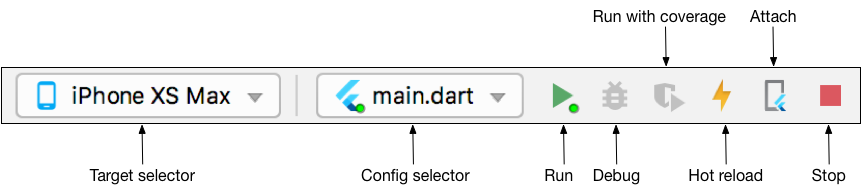

# Getting Started

## 1. System Requirements

Based on Flutter requirement. Please select the operating system on which you are installing Flutter

1. Mac OS: https://flutter.dev/docs/get-started/install/macos
2. Window: https://flutter.dev/docs/get-started/install/windows
3. Linux: https://flutter.dev/docs/get-started/install/linux
4. Setup an editor: https://flutter.dev/docs/get-started/editor

## 2. Setup Editor

There are different editor you can use for running a flutter app but the most commonly used are Android Studio & VS Code. Here is a link to the official documentation from the flutter theme on how to setup these editors: https://flutter.dev/docs/get-started/editor?tab=androidstudio

## 3. Installation

After download and unzip the project, use the preferred IDE (Android Studio / Visual Code / IntelliJ) to open the project folder.

1. Click the “Get dependencies” or “Packages get” to install the libraries from pubspecs.yaml file or run the following commad in the project folder.
   `flutter packages get`
2. Open the simulator to run iOS or Android (as the step above)
3. Then press the run button to start the project.

