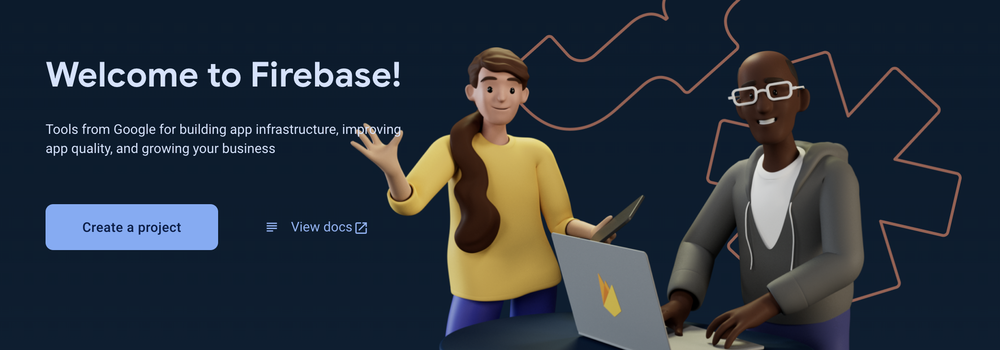
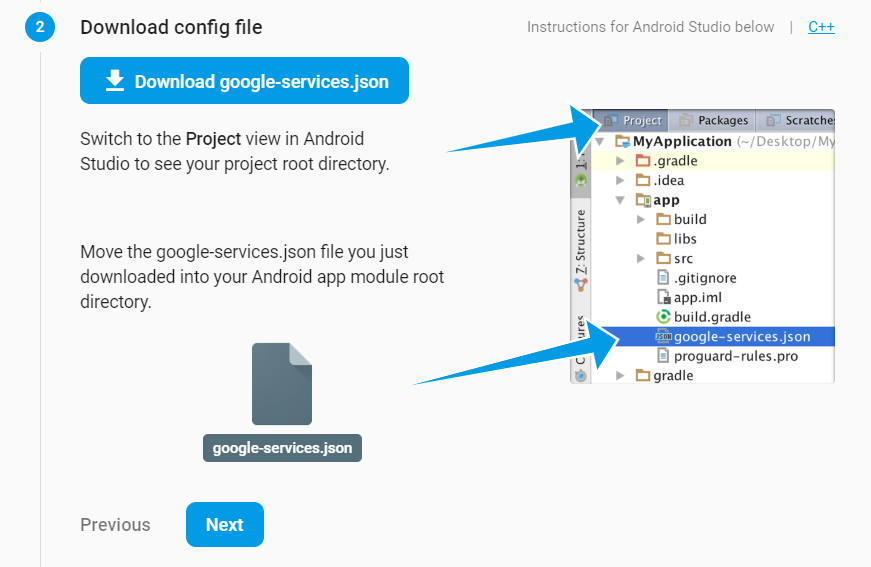

# Update Firebase

>[!NOTE] 
> Please make a copy of the project before following the instructions below. Just incase 
> the commands doesn't work as intended.

Your app will need to connect with a **`Firebase`** project, to complete `Social Login` and notification and others. To create and configure a **`Firebase`** account follow these steps :
1. Create a **`Firebase`** project. [Firebase](https://console.firebase.google.com/)
   
   
2. From  the Firebase console's **`Project overview page`**, register an `Android` app inside your project.
   
   
3. Download the **`google-services.json`** file & place it in your project’s **`android/app`** root directory.
   
   

For farther details and help, visit [FlutterFire](https://firebase.flutter.dev/docs/overview).

## Authentication

To setup the `authentication` using **`Firebase`**, Please follow the required steps mentioned [here](https://firebase.flutter.dev/docs/auth/overview).